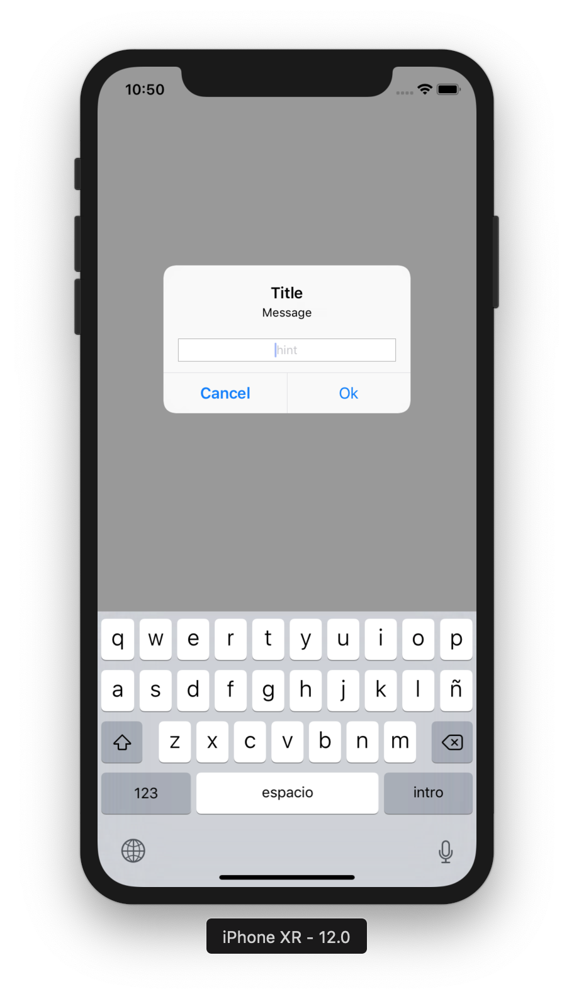
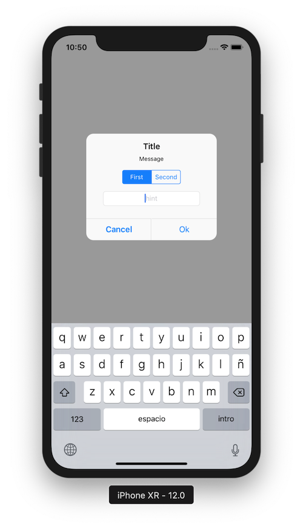

# CustomAlertView
Enhance AlertView that extends UIViewController

Description
--------------------------
An app example to show how to extend UIViewController class and create your own AlertView. It uses Storyboards for UI design and delegate pattern to handle AlertView actions.

Screenshots
--------------------------

Developed By
--------------------------

* Daniel Luque Quintana

License
-------

    Copyright 2017 Daniel Luque Quintana

    Licensed under the Apache License, Version 2.0 (the "License");
    you may not use this file except in compliance with the License.
    You may obtain a copy of the License at

       http://www.apache.org/licenses/LICENSE-2.0

    Unless required by applicable law or agreed to in writing, software
    distributed under the License is distributed on an "AS IS" BASIS,
    WITHOUT WARRANTIES OR CONDITIONS OF ANY KIND, either express or implied.
    See the License for the specific language governing permissions and
    limitations under the License.
